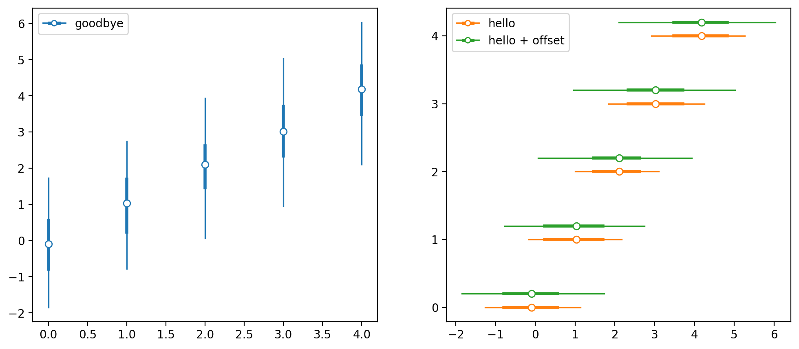
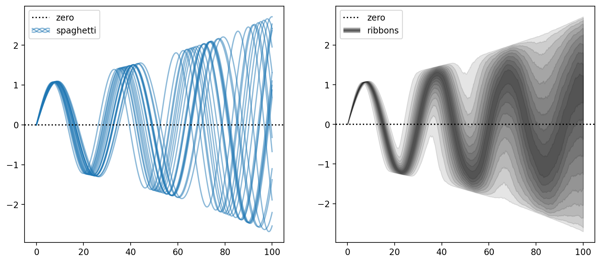
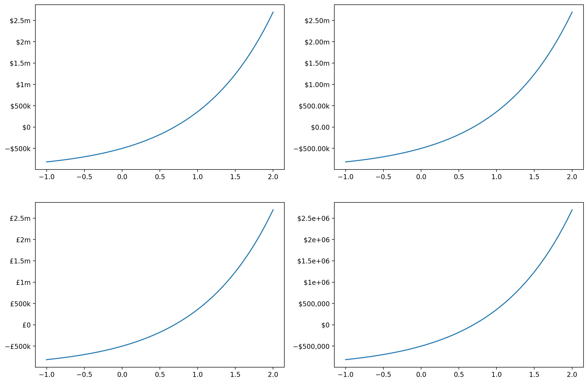

This is just a collection of plotting functions I find myself coming back to.

## Plot quantiles (simple box plot)

```python
import matplotlib.pyplot as plt
import numpy as np

rng = np.random.default_rng(42)
labels = rng.choice(5, size=1000)
values = rng.normal(loc=labels)

fig, axes = plt.subplots(1, 2, figsize=(12, 5))
plot_quantiles(labels, values, ax=axes[0], label='goodbye')
plot_quantiles(
    labels,
    values,
    pct_outer=75,
    ax=axes[1],
    color='C1',
    orientation='horizontal',
    label='hello'
)
plot_quantiles(
    labels + 0.2,
    values,
    ax=axes[1],
    color='C2',
    orientation='horizontal',
    label='hello + offset'
)

axes[0].legend(handler_map=handler_map)
axes[1].legend(handler_map=handler_map)
plt.show()
```



## Plot spaghetti and ribbons

```python
rng = np.random.default_rng(42)
timesteps = np.linspace(0, 100, num=1000)
freqs = rng.normal(30, 3, size=2000)
sine_wave = np.sin(2 * np.pi * timesteps / freqs[:, None])
sine_wave *= np.exp(timesteps / 100) [None, :]

fig, axes = plt.subplots(1, 2, figsize=(12, 5))
plot_spaghetti(timesteps, sine_wave, ax=axes[0], label='spaghetti')
plot_ribbons(timesteps, sine_wave, ax=axes[1], label='ribbons', color='k')
for ax in fig.axes:
    ax.axhline(0, linestyle=":", color='k', label='zero')
    ax.legend(handler_map=handler_map)
plt.show()
```




## Currency formatter

```python
x = np.linspace(-1, 2)
y = 5e5 * (np.exp(x) - 2)

formatters = [
    CurrencyFormatter(),
    CurrencyFormatter(decimals=2),
    CurrencyFormatter(symbol='£'),
    CurrencyFormatter(human_readable=False),
]
fig, axes = plt.subplots(2, 2, figsize=(15, 10))
for ax, formatter in zip(fig.axes, formatters):
    ax.plot(x, y)
    ax.yaxis.set_major_formatter(formatter)
plt.show()
```


